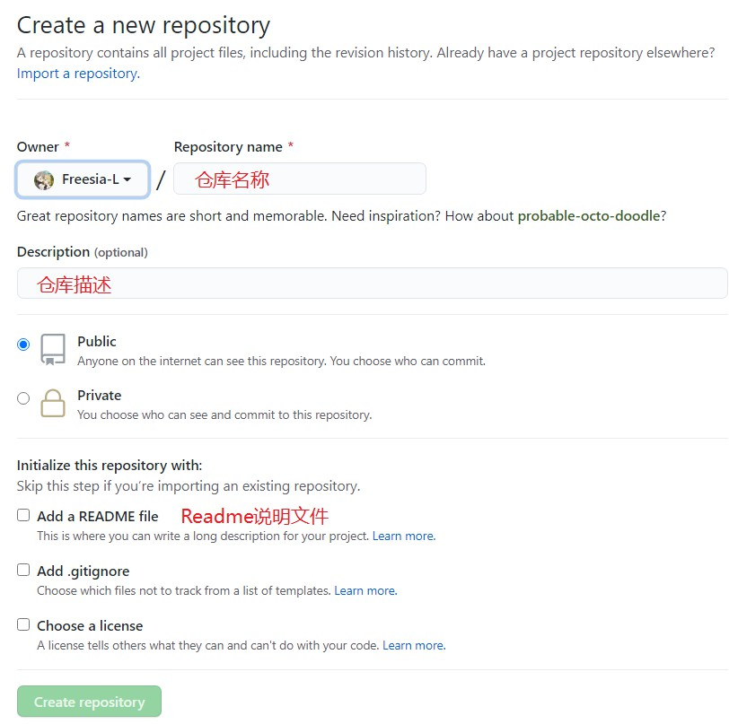

# Github初步使用

## 1 基础知识

**(1) 仓库 (Repository)**
仓库是用来存放项目代码的，每一项目对应一个仓库，多个开源项目则会有多个仓库。

**(2) 收藏 (Star)**
收藏别人的仓库，方便自己查找。

**(3) 复制/克隆项目 (Fork)**
复制别人的仓库到自己账号中，复制的仓库是独立于原仓库的。

可以通过向原作者发起请求 (Pull Request)，将自己对原仓库的更改发给原作者审核，审核通过便合并到原仓库中。

Fork也可以理解为分叉。

**(4) 关注(Watch)**
使用Watch功能关注了其他作者的仓库，如果作者的仓库发生更新，会发送通知到自己的账户上(类似于关注了别人就可以关注别人的动态)。

**(5) 事物卡片(Issue)**
发现别人的仓库代码出现Bug或有疑问时，可以通过Issue来和作者进行咨询和讨论。


## 2 搭建仓库网站


## 3 搭建GitHub个人网站


# Git初步使用

## 1 基础知识

**(1) 工作区(Working Directory)**
添加、编辑、修改文件等操作。

**(2)暂存区(Stage)**
暂存已修改的文件，最后会统一提交到Git仓库中。

**(3)Git仓库(Git Repository)**
最终确定的文件保存到Git仓库成为一个新版本。

**(4) 安装git**

[Git官网下载](https://git-scm.com/downloads)

## 2 Git同步Github    [参考链接](https://www.cnblogs.com/yiven/p/8465054.html)

**(1) 生成ssh Key**

```bash
# 以下操作在CMD或Git Bash都可以
# 首先要在本地创建一个ssh key 这个的目的就是你现在需要在你电脑上获得一个密匙
$ ssh-keygen -t rsa -C "youremail@youremail.com"  

# Generating public/private rsa key pair...
# 三次回车即可生成 ssh key

# 查看你的 public key，一般在C:\Users\UserName\.ssh目录
$ cat ~/.ssh/id_rsa.pub
# ssh-rsa AAAAB3NzaC1yc2E... youremail@youremail.com
```

**(2) 在Github添加ssh key**


**(3) 绑定ssh和Github**

```bash
# GitHub
$ ssh -T git@github.com
# 第一次绑定的时候输入上边的代码之后会提示是否continue,输入yes后程序会自动连接，如果要求登录，直接输入登录信息即可。
# 再次执行上面的命令，检查是否成功连接，如果返回以下信息，则表示添加成功
#GitHub
You've successfully authenticated, but GitHub does not provide shell access.
```

**可能报错：**

ssh: connect to host github.com port 22: Connection timed out

解决方案：[参考链接](https://blog.csdn.net/menglinjie/article/details/81115960)

先如下图在.ssh文件夹下建立一个config文件


config内容如下：

```bash
Host github.com
User 88888888@qq.com # your email
Hostname ssh.github.com
PreferredAuthentications publickey
IdentityFile ~/.ssh/id_rsa
Port 443
```

**(4) 设置基本信息**

```bash
#  name尽量和码云或GitHub保持一致，但email必须是码云或GitHub注册时使用的邮箱。命令不分前后，没有顺序。
$ git config --global user.name "yourname"
$ git config --global user.email "youremail@youremail.com"
```

**(5) 初始化仓库**

==**第一次创建最好别勾选README.md文件**==



**创建完成后：**


**根据上述提示，可以自己初始化仓库：**

```bash
# …or create a new repository on the command line
echo "# Python-Learning" >> README.md
git init
git add README.md
git commit -m "first commit"
git branch -M main
git remote add origin https://github.com/Freesia-L/Python-Learning.git
git push -u origin main

# …or push an existing repository from the command line
git remote add origin https://github.com/Freesia-L/Python-Learning.git
git branch -M main
git push -u origin main
```


## 3 Git常用指令

```bash
# 初始化Git仓库 几乎不用
# 在CMD或Git Bash通过cd命令跳转到相应目录(空文件夹)
git init # 该命令生成.git文件，是隐藏文件

# 克隆远程仓库代码到本地仓库
git clone repository_address

# 查看git状态
git status

#----------------#
git add file_name # 添加文件到暂存区
git add . # 添加全部
git reset -- [文件名] # 撤销暂存区修改
git reset -- # 撤销全部暂存区修改
git diff --cached # 查看工作区被跟踪的文件的修改详情

#----------------#
git commit -m ‘提交说明’ # 提交文件到git仓库
git log # 查看版本区的提交历史记录
git branch -avv # 查看全部分支信息

# 将本地仓库代码同步到远程仓库
git push

# 删除git仓库文件(删除命令后需要提交)
git rm file_name
```

